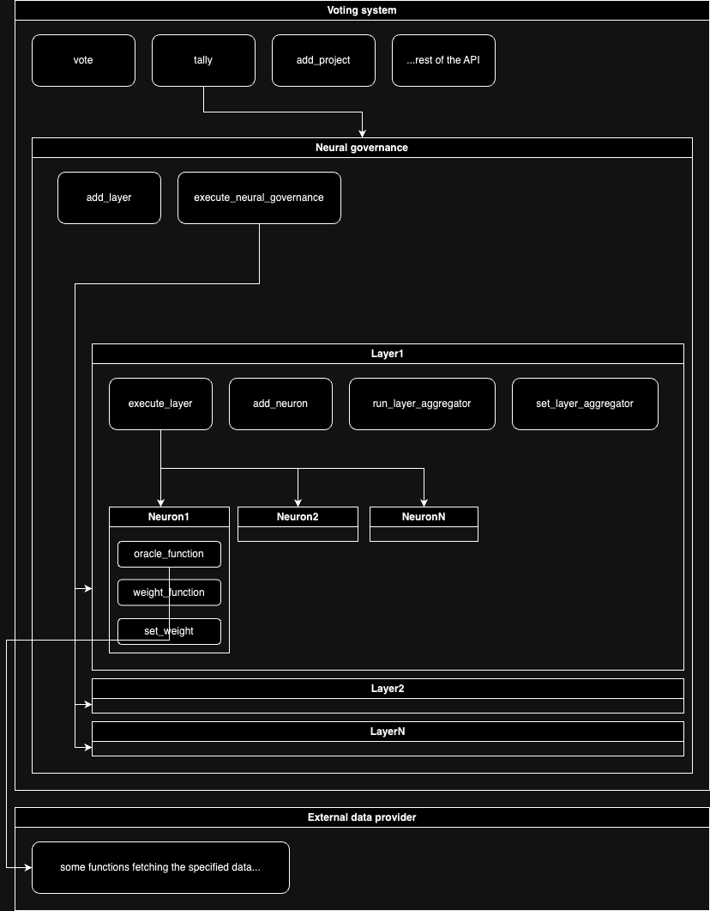

# Architecture

## Intro

This project is implemented using [cargo workspaces](https://doc.rust-lang.org/book/ch14-03-cargo-workspaces.html).
This workspace consists of the following packages:
- `voting_system`
- `neural_governance`
- `layer`
- `template_neuron`
- `assigned_reputation_neuron`
- `prior_voting_history_neuron`
- `external_data_provider`
- `shared`

They are described below. All of them are smart contracts apart of `shared` which stands for the code that's mutual for multiple other packages.

The structure of relations between the smart contracts is shown on the following diagram:

## Implementation notes

### Storage

For now, the `instance` option is used everywhere, but it is left as a `TODO` to do research about this once again and choose a proper way of using the storage; useful links:
- https://soroban.stellar.org/docs/fundamentals-and-concepts/persisting-data

The system is based on smart contracts that store references to other smart contracts. Sometimes the relation is `1-1`, sometimes `1-n`. It is implemented by storing the `Address` of one contract in the storage of another contract.
So, for example, if we have smart contracts: `A`, `B`, and `C`; and we want to store a single reference to `B` in `A`, and multiple references to `C` in `B`, we have to do these:
- build all contracts
- deploy any amount of contract instances we need, for example:
  - deploy `A` -> `addr_a1`
  - deploy `B` -> `addr_b1`
  - deploy `C` -> `addr_c1`
  - deploy `C` -> `addr_c2`
- store `addr_b1` in `A`
- store `addr_c1` in `B`
- store `addr_c2` in `B`

The types are:
- `soroban_sdk::Address` in `A`
- `soroban_sdk::Vec<soroban_sdk::Address>` in `B`

## Packages

### Voting System

`#[smart_contract]`

This is a package that will expose the API, if users need to do anything with this system, calls should go through this one.

- TODO: The API is not yet fully designed, once it is, describe all functions

#### storage:
- `neural_governance` - address of a single instance of the neural governance smart contract
- `votes` - map: `<project id => map<voter_id => Vote>>`, where `Vote` is an enum of `(YES, NO, ABSTAIN)`
- `projects` - a simple record of registered projects `Vec<project_id>`

#### functions:
- `add_project` - registers a project by its id
- `vote` - stores a single vote in the `votes` storage entry
- `tally` - takes all the votes from the storage, calls the neural governance (which does the actual calculations), and returns a map `<project_id => voting_result>`
- ...

### Neural Governance

`#[smart_contract]`

The neural governance manages all the layers and performs the calculations of the voting results for the current round.

#### storage:
- `layers` - list of addresses of the layers that will be triggered sequentially when calculating

#### functions:
- `add_layer`
- `execute_neural_governance` - performs the calculations. Sequentially triggers all the layers and their aggregators. For every layer it uses the previous layer's result as an input (there's none for the first one obviously).

### Layer

`#[smart_contract]`

Layer is responsible for storing neurons, calling them, and aggregating their output into a single value.

#### storage:
- `aggregator` - This is essentially an enum that specifies how the results from all the neurons will be combined together
- `neurons` - list of addresses of neurons that will be called when the layer's executed

#### functions:
- `add_neuron`
- `execute_layer` - Runs all the neurons and returns a collection of their results
- `run_layer_aggregator` - combines the results of all the neurons together based on the `aggregator` setting

### Neuron

`#[smart_contract]`

Neurons contain the logic for calculating the voting power of a user for a specific project. Every type of neuron may contain a different logic for doing that.

#### storage:
- `weight` - decimal number

#### functions:
- `oracle_function` - contains the logic of the neuron
- `weight_function` - multiplies the result of the `oracle_function` by the `weight` of the neuron

### Note

Please note that storage and functions may depend on the needs of specific neurons. This structure is for a basic neuron but it can be extended as much as needed. Please see [this](./architecture.md#custom-neurons).

### External Data Provider

`#[smart_contract]`

This is a contract that may be used by some neurons that require fetching the data from wherever outside of this system.

### Shared

This is not a smart contract. This package contains any code that is mutual for multiple other packages in this project.

## Custom neurons

If you wish to implement a new neuron, you should do the following steps:
- copy the folder `src/template_neuron` and rename the copy to a name of your choice, like this (from the root): `cp -r src/template_neuron src/new_neuron`
- add an entry in the `Cargo.toml`'s `members` entry: `./src/new_neuron`
- In the `src/new_neuron/Cargo.toml` change the package's name
- Start coding! You can now fill the `oracle_function` with your neuron's logic
- You can also write tests for your neuron
